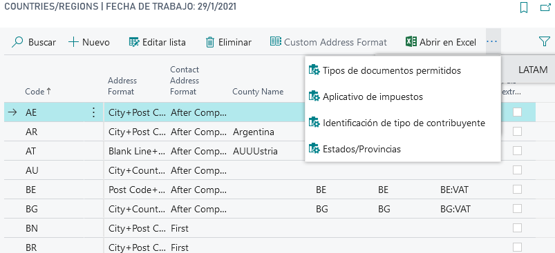
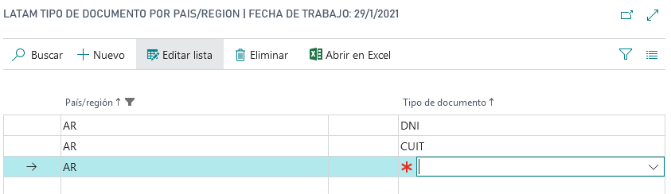

# LATAM Extension País/Región

## Descripción
Extensión a los proveedor de Business Central.

### Campos

>#### País extranjero
>>**Descripción**: 
	Indica que el país es extranjero o que no es el país donde esta radicada la empresa.
	
>>**Tipo**:text
### Acciones

>#### LATAM

>>##### Tipos de documentos permitidos (_Tipos de documentos por país/región_)

>>### Campos

>#### Tipo documento
>>**Descripción**: 
	Id de [Id de tipo de documento](../Maestros/LATAM-DocumentType.md) al cual el país va a tener acceso.
	
>>**Tipo**:Code[10]