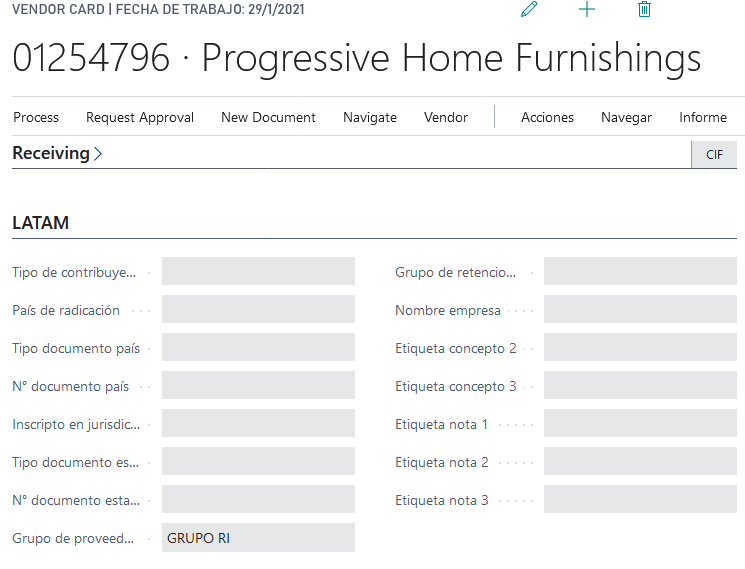

# LATAM Extension Proveedor

## Descripción
Extensión a los proveedor de Business Central.

### Campos

>#### Tipo de contribuyente
>>**Descripción**:
	Id a [Tipo Contribuyente](../Maestros/LATAM-TaxPayerType.md). El tipifica la entidad y fija ciertos comportamientos definidos en el maestro.
	ver [Comportamiento fijados por tipo de contribuyente](../Reglas/LATAM-Rules-TaxPayerType.md)

>>**Tipo**:Code[15]

>#### País de radicación

>>**Descripción**: 
	Id de país que indica donde esta radicado el proveedor.
	ver [Comportamiento fijados por tipo de contribuyente](../Reglas/LATAM-Rules-TaxPayerType.md)

	
>>**Tipo**:Code[10]

>#### Tipo documento país

>>**Descripción**: 
	Id a tipo de documento. Solo pueden cargarse tipos de documentos que tenga el flag [tipo documento país](../Maestros/LATAM-DocumentType.md#tipo-documento-pais) en `true`. ver [Comportamiento fijados por tipo de contribuyente](../Reglas/LATAM-Rules-TaxPayerType.md)

	
>>**Tipo**:Text[15]

>#### N° documento país
	
>>**Descripción**: 
	Número de documento del contribuyente. Si el tipo de documento tiene marcado [Validar máscara](../Maestros/LATAM-DocumentType.md#validar-mascara) o [Verifica método](../Maestros/LATAM-DocumentType.md#verifica-metodo). Este valor debe ser validado.ver [Comportamiento fijados por tipo de contribuyente](../Reglas/LATAM-Rules-TaxPayerType.md)

	
>>**Tipo**:Text[30]

>#### Inscripto en jurisdicción

>>**Descripción**: 
	Id [Estado](../Maestros/LATAM-State.md) en que está inscripto.
	ver [Comportamiento fijados por tipo de contribuyente](../Reglas/LATAM-Rules-TaxPayerType.md)

>>**Tipo**:Code[10]

>#### Tipo documento estado

>>**Descripción**: 
	Id a tipo de documento. Solo pueden cargarse tipos de documentos que tenga el flag [tipo documento estado](../Maestros/LATAM-DocumentType.md#tipo-documento-estado) en `true`. ver [Comportamiento fijados por tipo de contribuyente](../Reglas/LATAM-Rules-TaxPayerType.md)

	
>>**Tipo**:Text[15]

>#### N° documento estado
	
>>**Descripción**: 
	Número de documento del contribuyente. Si el tipo de documento tiene marcado [Validar máscara](../Maestros/LATAM-DocumentType.md#validar-mascara) o [Verifica método](../Maestros/LATAM-DocumentType.md#verifica-metodo). Este valor debe ser validado. ver [Comportamiento fijados por tipo de contribuyente](../Reglas/LATAM-Rules-TaxPayerType.md)

	
>>**Tipo**:Text[30]
	
>#### Grupo proveedor
>>**Descripción**: 
	Id. del grupo de tipo cuenta a la que pertenece el proveedor. Solo puede ser un grupo tipo cuenta cuyo tipo sea proveedor. Ver [tipo en grupo tipo cuenta](../../Maestros/LATAM-AccountTypeGroup/LATAM-AccountTypeGroup.md#tipo-de-cuenta)
	
>>**Tipo**:Code[20]

>#### Concepto 1
>>**Descripción**: 
	Campo de texto libre. Puede tener el significado que el usuario decida darle mediante la etiqueta definida en la [sección definido usuario proveedor, concepto 1](../../LATAM-Setup/LATAM-Setup.md#etiqueta-concepto-1_1). El valor que se ingrese en esa configuración determina el rótulo que va a tener en esta ventana.
	
>>**Tipo**:TextoText[250]

>#### Concepto 2
>>**Descripción**: 
	Mismo comportamiento que el campo concepto 1 pero para el campo concepto 2.
	
>>**Tipo**:TextoText[250]

>#### Concepto 3
>>**Descripción**: 
	Mismo comportamiento que el campo concepto 1 pero para el campo concepto 3.
	
>>**Tipo**:TextoText[250]

>#### Nota 1
>>**Descripción**: 
	Mismo comportamiento que el campo concepto 1 pero para el campo nota 1.
	
>>**Tipo**:TextoText[250]

>#### Nota 2
>>**Descripción**: 
	Mismo comportamiento que el campo concepto 1 pero para el campo nota 2.
	
>>**Tipo**:TextoText[250]

>#### Nota 3
>>**Descripción**: 
	Mismo comportamiento que el campo concepto 1 pero para el campo nota 3.
	
>>**Tipo**:TextoText[250]