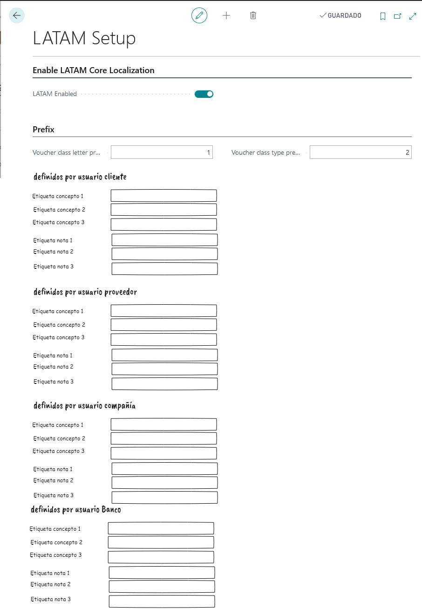

# LATAM Setup

## Descripción
Ventana de configuración que permite configurar comportamientos generales de la localización. Por ejemplo si la localización esta o no activada.

## Sección Habilitar localización core LATAM
### Campos

>#### LATAM habilitado
>>**Descripcion**: 
	Habilita o deshabilita la localización. Si este campo esta en falso el código de la localización no debería ejecutarse. Esto implica extensiones a páginas o código que ejecuta en puntos de integración.
	
>>**Tipo**:Booleano

## Sección prefijo
### Campos
>#### Long. prefijo letra clase comprobante
>>**Descripcion**: 
	Cantidad de caracteres que permite el campo letra de comprobante de la entidad [letra de comprobante](../LATAM-LATAMVoucherClassLetter/LATAM-LATAMVoucherClassLetter.md) letra de comprobante.
	
>>**Tipo**:Entero
>#### Long. prefijo tipo clase comprobante
>>**Descripcion**: 
	Cantidad de caracteres que permite el campo prefijo de clase de comprobante de la entidad clase de comprobante.
	
>>**Tipo**:Entero

### Sección definidos por usuario cliente
### Campos
>#### Etiqueta concepto 1
>>**Descripción**: 
	Define la etiqueta que va a tener el [campo concepto 1 de la extensión cliente](../Extensiones/LATAM-Customer/LATAM-Customer.md#concepto-1). Es decir el valor que se de a este campo es la etiqueta que va a tomar en la extensión de la entidad clientes.
	
>>**Tipo**:Texto(20)

>#### Etiqueta concepto 2
>>**Descripción**: 
	Define lo mismo que etiqueta concepto 1 pero para el [campo concepto 2 de la extensión cliente](../Extensiones/LATAM-Customer/LATAM-Customer.md#concepto-2).
	
>>**Tipo**:Texto(20)

>#### Etiqueta concepto 3
>>**Descripción**: 
	Define lo mismo que etiqueta concepto 1 pero para el [campo concepto 3 de la extensión cliente](../Extensiones/LATAM-Customer/LATAM-Customer.md#concepto-3).
	
>>**Tipo**:Texto(20)

>#### Etiqueta Nota 1
>>**Descripción**: 
	Define lo mismo que etiqueta concepto 1 pero para el [campo nota 1 de la extensión cliente](../Extensiones/LATAM-Customer/LATAM-Customer.md#nota-1).
	
>>**Tipo**:Texto(20)

>#### Etiqueta Nota 2
>>**Descripción**: 
	Define lo mismo que etiqueta concepto 1 pero para el [campo nota 2 de la extensión cliente](../Extensiones/LATAM-Customer/LATAM-Customer.md#nota-2).
	
>>**Tipo**:Texto(20)

>#### Etiqueta Nota 3
>>**Descripción**: 
	Define lo mismo que etiqueta concepto 1 pero para el [campo nota 3 de la extensión cliente](../Extensiones/LATAM-Customer/LATAM-Customer.md#nota-3).
	
>>**Tipo**:Texto(20)

### Sección definidos por usuario proveedor
>#### Etiqueta concepto 1
>>**Descripción**: 
	Define la etiqueta que va a tener el [campo concepto 1 de la extensión proveedor](../Extensiones/LATAM-Vendor/LATAM-Vendor.md#concepto-1). Es decir el valor que se de a este campo es la etiqueta que va a tomar en la extensión de la entidad proveedor.
	
>>**Tipo**:Texto(20)

>#### Etiqueta concepto 2
>>**Descripción**: 
	Define lo mismo que etiqueta concepto 1 pero para el [campo concepto 2 de la extensión proveedor](../Extensiones/LATAM-Vendor/LATAM-Vendor.md#concepto-2).
	
>>**Tipo**:Texto(20)

>#### Etiqueta concepto 3
>>**Descripción**: 
	Define lo mismo que etiqueta concepto 1 pero para el [campo concepto 3 de la extensión proveedor](../Extensiones/LATAM-Vendor/LATAM-Vendor.md#concepto-3).
	
>>**Tipo**:Texto(20)

>#### Etiqueta Nota 1
>>**Descripción**: 
	Define lo mismo que etiqueta concepto 1 pero para el [campo nota 1 de la extensión proveedor](../Extensiones/LATAM-Vendor/LATAM-Vendor.md#nota-1).
	
>>**Tipo**:Texto(20)

>#### Etiqueta Nota 2
>>**Descripción**: 
	Define lo mismo que etiqueta concepto 1 pero para el [campo nota 2 de la extensión proveedor](../Extensiones/LATAM-Vendor/LATAM-Vendor.md#nota-2).
	
>>**Tipo**:Texto(20)

>#### Etiqueta Nota 3
>>**Descripción**: 
	Define lo mismo que etiqueta concepto 1 pero para el [campo nota 3 de la extensión proveedor](../Extensiones/LATAM-Vendor/LATAM-Vendor.md#nota-3).
	
>>**Tipo**:Texto(20)

### Sección definidos por usuario banco
>#### Etiqueta concepto 1
>>**Descripción**: 
	Define la etiqueta que va a tener el [campo concepto 1 de la extensión banco](../Extensiones/LATAM-Bank/LATAM-Bank.md#concepto-1). Es decir el valor que se de a este campo es la etiqueta que va a tomar en la extensión de la entidad proveedor.
	
>>**Tipo**:Texto(20)

>#### Etiqueta concepto 2
>>**Descripción**: 
	Define lo mismo que etiqueta concepto 1 pero para el [campo concepto 2 de la extensión banco](../Extensiones/LATAM-Bank/LATAM-Bank.md#concepto-2).
	
>>**Tipo**:Texto(20)

>#### Etiqueta concepto 3
>>**Descripción**: 
	Define lo mismo que etiqueta concepto 1 pero para el [campo concepto 3 de la extensión banco](../Extensiones/LATAM-Bank/LATAM-Bank.md#concepto-3).
	
>>**Tipo**:Texto(20)

>#### Etiqueta Nota 1
>>**Descripción**: 
	Define lo mismo que etiqueta concepto 1 pero para el [campo nota 1 de la extensión banco](../Extensiones/LATAM-Bank/LATAM-Bank.md#nota-1).
	
>>**Tipo**:Texto(20)

>#### Etiqueta Nota 2
>>**Descripción**: 
	Define lo mismo que etiqueta concepto 1 pero para el [campo nota 2 de la extensión banco](../Extensiones/LATAM-Bank/LATAM-Bank.md#nota-2).
	
>>**Tipo**:Texto(20)

>#### Etiqueta Nota 3
>>**Descripción**: 
	Define lo mismo que etiqueta concepto 1 pero para el [campo nota 3 de la extensión banco](../Extensiones/LATAM-Bank/LATAM-Bank.md#nota-3).
	
>>**Tipo**:Texto(20)
### Sección definidos por usuario compañía
>#### Etiqueta concepto 1
>>**Descripción**: 
	Define la etiqueta que va a tener el [campo concepto 1 de la extensión compañía](../Extensiones/LATAM-CompanyInformation/LATAM-CompanyInformation.md#concepto-1). Es decir el valor que se de a este campo es la etiqueta que va a tomar en la extensión de la entidad proveedor.
	
>>**Tipo**:Texto(20)

>#### Etiqueta concepto 2
>>**Descripción**: 
	Define lo mismo que etiqueta concepto 1 pero para el [campo concepto 2 de la extensión compañía](../Extensiones/LATAM-CompanyInformation/LATAM-CompanyInformation.md#concepto-2).
	
>>**Tipo**:Texto(20)

>#### Etiqueta concepto 3
>>**Descripción**: 
	Define lo mismo que etiqueta concepto 1 pero para el [campo concepto 3 de la extensión compañía](../Extensiones/LATAM-CompanyInformation/LATAM-CompanyInformation.md#concepto-3).
	
>>**Tipo**:Texto(20)

>#### Etiqueta Nota 1
>>**Descripción**: 
	Define lo mismo que etiqueta concepto 1 pero para el [campo nota 1 de la extensión compañía](../Extensiones/LATAM-CompanyInformation/LATAM-CompanyInformation.md#nota-1).
	
>>**Tipo**:Texto(20)

>#### Etiqueta Nota 2
>>**Descripción**: 
	Define lo mismo que etiqueta concepto 1 pero para el [campo nota 2 de la extensión compañía](../Extensiones/LATAM-CompanyInformation/LATAM-CompanyInformation.md#nota-2).
	
>>**Tipo**:Texto(20)

>#### Etiqueta Nota 3
>>**Descripción**: 
	Define lo mismo que etiqueta concepto 1 pero para el [campo nota 3 de la extensión compañía](../Extensiones/LATAM-CompanyInformation/LATAM-CompanyInformation.md#nota-3).
	
>>**Tipo**:Texto(20)

