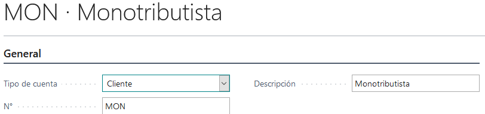
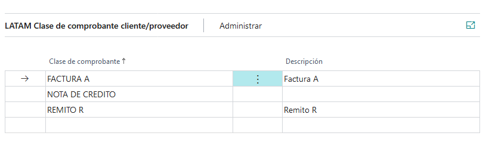

# Grupo de tipo de cuenta

## Descripción
Maestro de grupo de tipo de cuenta. Crea una tipificación para un tipo de cuenta. 
Los tipos de cuenta son:

* Cliente
* Proveedor
* banco
* Inventario
* Ledger??

 Esta tipificación permite asociar o definir un conjunto de [clases de comprobantes](../Maestros/LATAM-VoucherClass.md), de tal modo que toda cuenta que use esta tipificación  tendrá acceso a los comprobantes que tenga este grupo. 
Además de esto permite definir comprobantes por defecto para algunos documentos o transacciones. Por ejemplo si se define el comprobante `FACTURA A` como comprobante por defecto para factura de cliente. Al momento de cargar una factura para un cliente que tenga este grupo, el comprobante `FACTURA A` debe estar pre cargado en el campo [clase de comprobante del formulario Extensión de documento](../LATAM-DocumentExtension/LATAM-DocumentExtension.md#clase-de-comprobante). Este mismo comportamiento aplica para otros documentos y otras entidades que se detallan mas abajo. en la secciones 

* [Clase de comprobantes por defecto de cliente](../Maestros/LATAM-AccountTypeGroup.md#seccion-clase-de-comprobante-por-defecto-de-cliente)

* [Clase de comprobantes por defecto de proveedor](../Maestros/LATAM-AccountTypeGroup.md#seccion-clase-de-comprobante-por-defecto-de-proveedor)

## Sección General

### Campos

>#### Tipo de cuenta
>>**Descripción**: Especifica a que tipo de cuenta va a tipificar. 

>>> * Cliente
>>> * Proveedor
>>> * banco
>>> * Inventario
>>> * Ledger??

un grupo tipo cuenta cuyo tipo cuenta es `cliente` solo puede ser usado en la extensión de cliente. Uno tipo proveedor solo puede tipificar a proveedores y así sucesivamente.
>>**Tipo**:Code

>#### No.
>>**Descripción**: 
	
>>**Tipo**:Code

>#### Descripción
>>**Descripción**: 
	
>>**Tipo**:Code

## Sección clase de comprobante Cliente/Proveedor 

### Campos
>#### Clase de comprobante
>>**Descripción**: 
	Id de [clases de comprobantes](../Maestros/LATAM-VoucherClass.md)
	
>>**Tipo**:Code

>#### Descripción
>>**Descripción**: 
	Descripción de [clases de comprobantes](../Maestros/LATAM-VoucherClass.md)
	
>>**Tipo**:Text

## Sección Clase de comprobante por defecto de cliente

### Campos
>#### Nota de crédito de servicio
>>**Descripción**: 
	Id de [clases de comprobantes](../Maestros/LATAM-VoucherClass.md) que será propuesto como clase de comprobante por defecto al crear una nota de crédito de servicio. En este campo solo 	se pueden cargar comprobante cuyo tipo clase de comprobante tenga marcado el [check Notas de crédito de servicio](../Maestros/LATAM-VoucherClassType.md#notas-de-credito-de-servicio)
	
>>**Tipo**:Code[15]

>#### Factura de servicio
>>**Descripción**: 
	Id de [clases de comprobantes](../Maestros/LATAM-VoucherClass.md) que será propuesto como clase de comprobante por defecto al crear una factura de servicio. En este campo solo se pueden cargar comprobante cuyo tipo clase de comprobante tenga marcado el [check Factura de servicio](../Maestros/LATAM-VoucherClassType.md#factura-de-servicio) 
	
>>**Tipo**:Code[15]

>#### Remito de zona franca
>>**Descripción**: 
	Id de [clases de comprobantes](../Maestros/LATAM-VoucherClass.md) que será propuesto como clase de comprobante por defecto al crear un remito de servicio. En este campo solo se pueden cargar comprobante cuyo tipo clase de comprobante tenga marcado el [check Remito](../Maestros/LATAM-VoucherClassType.md#remito)  
	
>>**Tipo**:Code[15]

>#### Remito
>>**Descripción**: 
	Id de [clases de comprobantes](../Maestros/LATAM-VoucherClass.md) que será propuesto como clase de comprobante por defecto al crear un remito de compra/ventas. En este campo solo se pueden cargar comprobante cuyo tipo clase de comprobante tenga marcado el [check Remito](../Maestros/LATAM-VoucherClassType.md#remito)
	
>>**Tipo**:Code[15]

>#### Nota de crédito de proyecto
>>**Descripción**: 
	Id de [clases de comprobantes](../Maestros/LATAM-VoucherClass.md) que será propuesto como clase de comprobante por defecto al crear una nota de crédito de proyecto. En este campo solo se pueden cargar comprobante cuyo tipo clase de comprobante tenga marcado el [check nota de crédito de proyecto](../Maestros/LATAM-VoucherClassType.md#notas-de-credito-de-proyecto) 
	
>>**Tipo**:Code[15]

>#### Factura de proyecto
>>**Descripción**: 
	Id de [clases de comprobantes](../Maestros/LATAM-VoucherClass.md) que será propuesto como clase de comprobante por defecto al crear una factura de proyecto. En este campo solo se pueden cargar comprobante cuyo tipo clase de comprobante tenga marcado el [check Factura de proyecto](../Maestros/LATAM-VoucherClassType.md#factura-de-proyecto) 
	
>>**Tipo**:Code[15]

>#### Remito de proyecto
>>**Descripción**: 
	Id de [clases de comprobantes](../Maestros/LATAM-VoucherClass.md) que será propuesto como clase de comprobante por defecto al crear un remito de proyecto. En este campo solo se pueden cargar comprobante cuyo tipo clase de comprobante tenga marcado el [check Remito de proyecto](../Maestros/LATAM-VoucherClassType.md#remito-de-proyecto)
	
>>**Tipo**:Code[15]

>#### Remito de devolución proyecto
>>**Descripción**: 
	Id de [clases de comprobantes](../Maestros/LATAM-VoucherClass.md) que será propuesto como clase de comprobante por defecto al crear una devolución de proyecto. En este campo solo se pueden cargar comprobante cuyo tipo clase de comprobante tenga marcado el [check Remito de devolución proyecto](../Maestros/LATAM-VoucherClassType.md#remito-de-devolucion-proyecto)
	
>>**Tipo**:Code[15]

>#### Remito de reembolso
>>**Descripción**: 
	Id de [clases de comprobantes](../Maestros/LATAM-VoucherClass.md) que será propuesto como clase de comprobante por defecto al crear una entrada en diario de crédito. En este campo solo se pueden cargar comprobante cuyo tipo clase de comprobante tenga marcado el [check Remito de devolución](../Maestros/LATAM-VoucherClassType.md#remito-de-devolucion)
>>**Tipo**:Code[15]

>#### Nota de crédito de venta
>>**Descripción**: 
	Id de [clases de comprobantes](../Maestros/LATAM-VoucherClass.md) que será propuesto como clase de comprobante por defecto al crear una nota de crédito de ventas. En este campo solo se pueden cargar comprobante cuyo tipo clase de comprobante tenga marcado el [check Nota de crédito de venta](../Maestros/LATAM-VoucherClassType.md#notas-de-credito-de-ventas) 
	
>>**Tipo**:Code[15]

>#### Factura de venta
>>**Descripción**: 
	Id de [clases de comprobantes](../Maestros/LATAM-VoucherClass.md) que será propuesto como clase de comprobante por defecto al crear una factura de ventas. En este campo solo se pueden cargar comprobante cuyo tipo clase de comprobante tenga marcado el [check Factura de venta](../Maestros/LATAM-VoucherClassType.md#factura-ventas)  
	
>>**Tipo**:Code[15]

## Sección Clase de comprobante por defecto de proveedor

### Campos
>#### Diario de crédito
>>**Descripción**: 
	Id de [clases de comprobantes](../Maestros/LATAM-VoucherClass.md) que será propuesto como clase de comprobante por defecto al crear una entrada en el diario del proveedor al crédito. En este campo solo se pueden cargar comprobante cuyo tipo clase de comprobante tenga marcado el check [Línea de crédito de diario de proveedor](../Maestros/LATAM-VoucherClassType.md#linea-de-credito-de-diario-de-proveedor) 
	
>>**Tipo**:Code[15]

>#### Diario de débito
>>**Descripción**: 
	Id de [clases de comprobantes](../Maestros/LATAM-VoucherClass.md) que será propuesto como clase de comprobante por defecto al crear una entrada  en el diario del proveedor al débito. En este campo solo se pueden cargar comprobante cuyo tipo clase de comprobante tenga marcado el check [Línea de débito de diario de proveedor](../Maestros/LATAM-VoucherClassType.md#linea-de-debito-de-diario-de-proveedor)
	
>>**Tipo**:Code[15]

>#### Medio de pago predeterminado
>>**Descripción**: 
	Id de [clases de comprobantes](../Maestros/LATAM-VoucherClass.md) que será propuesto como clase de comprobante por defecto al crear un medio de cobro pago para un proveedor. En este campo solo se pueden cargar comprobante que tenga marcado el [Medio de cobro/pago](../Maestros/LATAM-VoucherClassType.md#medio-de-cobropago)
	
>>**Tipo**:Code[15]

>#### Remito
>>**Descripción**: 
	Id de [clases de comprobantes](../Maestros/LATAM-VoucherClass.md) que será propuesto como clase de comprobante por defecto al crear un remito de compras. En este campo solo se pueden cargar comprobante cuyo tipo clase de comprobante tenga marcado el [check Remito](../Maestros/LATAM-VoucherClassType.md#remito)
	
>>**Tipo**:Code[15]

>#### Nota de crédito de compra
>>**Descripción**: 
	Id de [clases de comprobantes](../Maestros/LATAM-VoucherClass.md) que será propuesto como clase de comprobante por defecto al crear una nota de crédito de compras. En este campo solo se pueden cargar comprobante cuyo tipo clase de comprobante tenga marcado el [check Nota de crédito de compra](../Maestros/LATAM-VoucherClassType.md#notas-de-credito-de-compras)  
	
>>**Tipo**:Code[15]

>#### Factura de compra
>>**Descripción**: 
	Id de [clases de comprobantes](../Maestros/LATAM-VoucherClass.md) que será propuesto como clase de comprobante por defecto al crear una factura de compras. En este campo solo se pueden cargar comprobante cuyo tipo clase de comprobante tenga marcado el [check Factura compra](../Maestros/LATAM-VoucherClassType.md#factura-compras)   
	
>>**Tipo**:Code[15]

>#### Remito de reembolso
>>**Descripción**: 
	Id de [clases de comprobantes](../Maestros/LATAM-VoucherClass.md) que será propuesto como clase de comprobante por defecto al crear una entrada en diario de crédito. En este campo solo se pueden cargar comprobante cuyo tipo clase de comprobante tenga marcado el [check Remito de devolución](../Maestros/LATAM-VoucherClassType.md#remito-de-devolucion)   
>>**Tipo**:Code[15]

