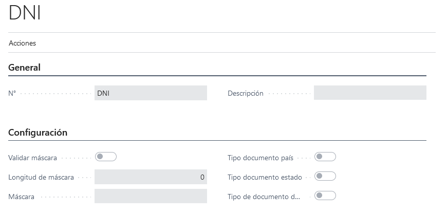

# LATAM Tipo Documento

## Descripción
Maestro de tipos de documentos. Permite especificar algunas características para los número de documentos ingresados por ejemplo formato, si usa o no algoritmo de verificación (CUIT, RUC), si es o no un documento del exterior, estado o país.

## Sección General
### Campos

>#### No.
>>**Descripción**: 
	Id de la entidad.
	
>#### Descripción
>>**Descripción**: 
	Breve descripción de tipo de documento.
	
>>**Tipo**:text

## Sección configuración
### Campos

>#### Validar máscara
>>**Descripción**: 
	Indica si hay que validar o no la mascara. Si esta deshabilitado el campo máscara se habilitará y deshabilitado en caso que este en `false`.
	
>>**Tipo**:boolean
	
>#### Verifica método
>>**Descripción**: 
	Si tiene implementado un método de verificación, ejecuta dicho método para verificar si el número de documento ingresado es correcto.

>>**Tipo**:boolean

>#### Máscara
>>**Descripción**: 
	Cantidad de caracteres que permite el campo prefijo de clase de comprobante de la entidad clase de comprobante.
	
>>**Tipo**:Entero

>#### Longitud máscara
>>**Descripción**: 
	Cantidad máxima de caracteres que permite la máscara.
	
>>**Tipo**:Entero

>#### Tipo documento país
>>**Descripción**: 
	Indica que este tipo de documento es de país.
	
>>**Tipo**:boolean

>#### Tipo documento estado
>>**Descripción**: 
	Indica que este tipo de documento es estado.
	
>>**Tipo**:boolean

>#### Tipo documento exterior
>>**Descripción**: 
	Indica que este tipo de documento es del exterior.
	
>>**Tipo**:boolean