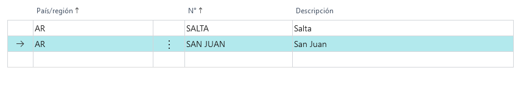

# LATAM Estado

## Descripción
Maestros de estados de LATAM.
### Campos

>#### País/Región
>>**Descripción**: 
	Id de País al que pertenece el estado.
	
>>**Tipo**:Code[10]

>#### N°

>>**Descripción**: 
	Id de estado.
	
>>**Tipo**:Code[10]

>#### Descripción

>>**Descripción**: 
	texto descriptivo.
	
>>**Tipo**:Text[60]

