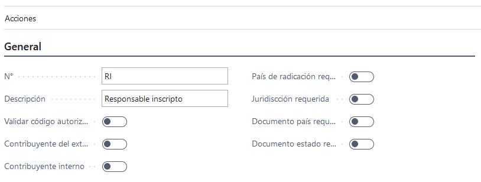
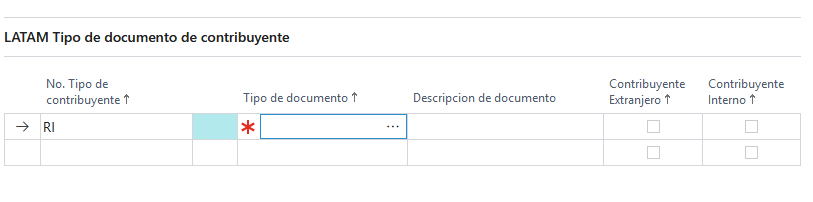

# LATAM Tipo contribuyente

## Descripción
De acuerdo a nuestra legislación, los contribuyentes pueden adoptar diferentes condiciones impositivas frente al fisco. Por ejemplo, Responsable Inscripto, Exento, Sujeto del exterior, etc.  Es por ello que se requiere un maestro, donde se puedan dar de alta todos los tipos de documento válidos para identificar a todos los sujetos con los que realiza operaciones la compañía (clientes, proveedores, empleados, e incluso a la propia compañía).

## Sección general

### Campos

>#### No.
>>**Descripción**: 
Identificador único de tipo contribuyente.

>>**Tipo**:Code

>#### Descripción.
>>**Descripción**: 
Breve descripción.

>>**Tipo**:Text

>#### Validar código autorización proveedor
>>**Descripción**: 
Solo tiene validez si esta clase de contribuyente se usa con un proveedor. Este flag indica que los documentos de este proveedor (factura, notas de crédito) van a requerir un CA al momento de ser cargados.

>>**Tipo**:Boolean

>#### Contribuyente exterior
>>**Descripción**: 
Indica que es un contribuyente del exterior. Este flag impacta en los documentos a los cuales tiene acceso en la [sección tipo documento contribuyente](#seccion-tipo-documento-contribuyente). Si este flag esta en ``true`` entonces el lookup solo mostrará documentos que tengan el flag [Tipo documento exterior](LATAM-DocumentType.md#tipo-documento-exterior) en ``true``. 
Por ejemplo puede darse de alta PERSONA FISICA DEL EXTERIOR, PERSONA JURIDICA DEL EXTERIOR, y en ambos debería el usuario marcar la opción Exterior (SI / NO). 
El campo  Exterior va a ser utilizado en el maestro país para filtrar que opciones de Tipo Contribuyente se muestran o admiten al seleccionar para dicho maestro.   Si el país está configurado como Exterior = SI solo se mostraran en el look-up los Tipo Contribuyente que tienen configurado Exterior = Si.   Y si el país está configurado como Exterior = No solo se mostraran en el look-up los Tipo Contribuyente que tienen configurado Exterior = No. 

>>**Tipo**:Boolean

>#### Contribuyente interno
>>**Descripción**: 
permite configurar un Tipo de Contribuyente Interno, que no represente un cliente o proveedor real. Todas las transacciones realizadas por proveedores o clientes que posean este Tipo  en su maestro,  no deberían informarse en lo archivos magnéticos y Libros de IVA.

>>**Tipo**:Boolean

>#### País de radicación requerido
>>**Descripción**: 
Para toda entidad que use una clase de contribuyente que tenga este flag en ``true`` hace que el campo país de radicación sea requerido. Por ejemplo en [país de radicación](../Extensiones/LATAM-Customer.md#pais-de-radicacion) del cliente.

>>**Tipo**:Boolean

>#### Jurisdicción requerida
>>**Descripción**: 
Para toda entidad que use una clase de contribuyente que tenga este flag en ``true`` hace que el Inscripto en jurisdicción sea requerido. Por ejemplo en [Inscripto en jurisdicción](../Extensiones/LATAM-Customer.md#inscripto-en-jurisdiccion) del cliente.
>>**Tipo**:Boolean

>#### Documento país requerido
>>**Descripción**: 
Para toda entidad que use una clase de contribuyente que tenga este flag en ``true`` hace que los campos N° documento país y Tipo documento país sean requerido. Por ejemplo en [la extension del cliente](../Extensiones/LATAM-Customer.md#tipo-documento-pais).

>>**Tipo**:Boolean

>#### Documento estado requerido
>>**Descripción**: 
Para toda entidad que use una clase de contribuyente que tenga este flag en ``true`` hace que los campos N° documento estado y Tipo documento estado sean requerido. Por ejemplo en [la extension del cliente](../Extensiones/LATAM-Customer.md#tipo-documento-estado).

>>**Tipo**:Boolean

## Sección tipo documento contribuyente

Se cargan los tipos de documentos que va a tener acceso el tipo de contribuyente que se esta dando de alta.
Se requiere que al menos un tipo de documento con el que se identifica al tipo de contribuyente que se esté dando de alta o modificando.  No obstante un Tipo de Contribuyente puede aceptar más de un Tipo de Documento. 

### Campos
>#### Tipo documento
>>**Descripción**: 
	[Id de tipo de documento](../Maestros/LATAM-DocumentType.md). Los documentos cargados aca, deben respetar el check de configuración [Contribuyente exterior](#contribuyente-exterior). Si es del exterior traer documentos del exterior y de no ser del exterior traer los que no son del exterior.
	
>>**Tipo**:Code[15]
>#### Descripción
>>**Descripción**: 
	descripción del tipo de documento.
	
>>**Tipo**:text

## Reglas en general: 

Si el Tipo Contribuyente no es Interno y no es del Exterior entonces: 

* País de radicación obligatorio debe ser `true`. Independientemente de esto, deberá poder ser configurable a nivel de usuario. 

* Jurisdicción inscripta obligatorio debe ser `true`. Independientemente de esto, deberá poder ser configurable a nivel de usuario. 

* Número identificación país obligatorio debe ser `true`. Independientemente de esto, deberá poder ser configurable a nivel de usuario. 

* Número identificación estado obligatorio debe ser `true`. Independientemente de esto, deberá poder ser configurable a nivel de usuario. 

* Valida CAI Proveedor puede ser `true` o `false` 

 

Si el Tipo contribuyente es Interno entonces: 

* Exterior debe ser `false`

* País de radicación obligatorio   debe ser `false`. Independientemente de esto, deberá poder ser configurable a nivel de usuario. 

* Jurisdicción inscripta obligatorio debe ser `false`. Independientemente de esto, deberá poder ser configurable a nivel de usuario. 

* Número identificación país obligatorio debe ser `false`. Independientemente de esto, deberá poder ser configurable a nivel de usuario. 

* Número identificación estado obligatorio debe ser `false`. Independientemente de esto, deberá poder ser configurable a nivel de usuario. 

* Valida CAI Proveedor debe ser `false` 

 

Si el Tipo contribuyente es del exterior entonces: 

* Interno debe ser `false` 

* País de radicación obligatorio   debe ser `true`. Independientemente de esto, deberá poder ser configurable a nivel de usuario. 

* Jurisdicción inscripta obligatorio puede ser `true` o `false`. Independientemente de esto, deberá poder ser configurable a nivel de usuario. 

* Número identificación país obligatorio puede ser `true` o `false`. Independientemente de esto, deberá poder ser configurable a nivel de usuario. 

* Número identificación estado obligatorio puede ser `true` o `false`   (Si es `true` debe ser `true` el de País). Independientemente de esto, deberá poder ser configurable a nivel de usuario. 

* Valida CAI Proveedor debe ser `false` 
