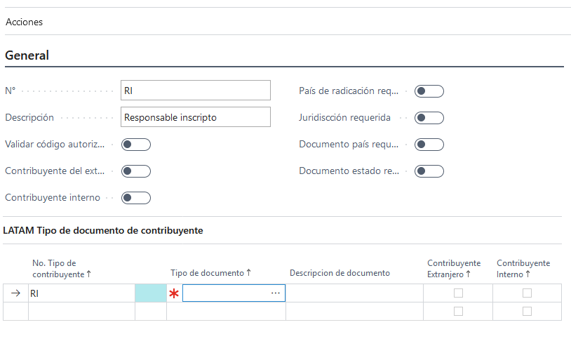

# LATAM Tax Payer Type

## Descripción
Ventana de configuración de tipo de contribuyente.

## Sección general
### Campos

>#### No.
>>**Descripción**: 

>>**Tipo**:Code

>#### Descripción.
>>**Descripción**: 

>>**Tipo**:Text

>#### Valida código de autorización proveedor
>>**Descripción**: 

>>**Tipo**:Boolean

>#### Contribuyente exterior
>>**Descripción**: 

>>**Tipo**:Boolean

>#### Contribuyente interno
>>**Descripción**: 

>>**Tipo**:Boolean

>#### País de radicación requerido
>>**Descripción**: 

>>**Tipo**:Boolean

>#### Documento estado requerido
>>**Descripción**: 

>>**Tipo**:Boolean

>#### Juridiscción requerida
>>**Descripción**: 

>>**Tipo**:Boolean

>#### Documento estado requerido
>>**Descripción**: 

>>**Tipo**:Boolean

## Sección tipo documento contribuyente
### Campos
>#### Tipo documento
>>**Descripción**: 
	
	
>>**Tipo**:Code
>#### Descripción
>>**Descripción**: 
	
	
>>**Tipo**:text