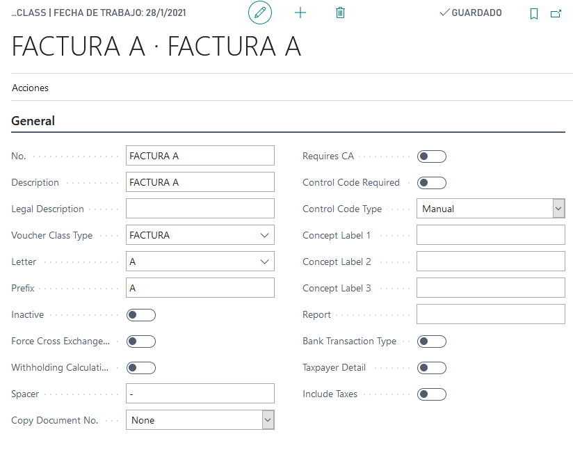
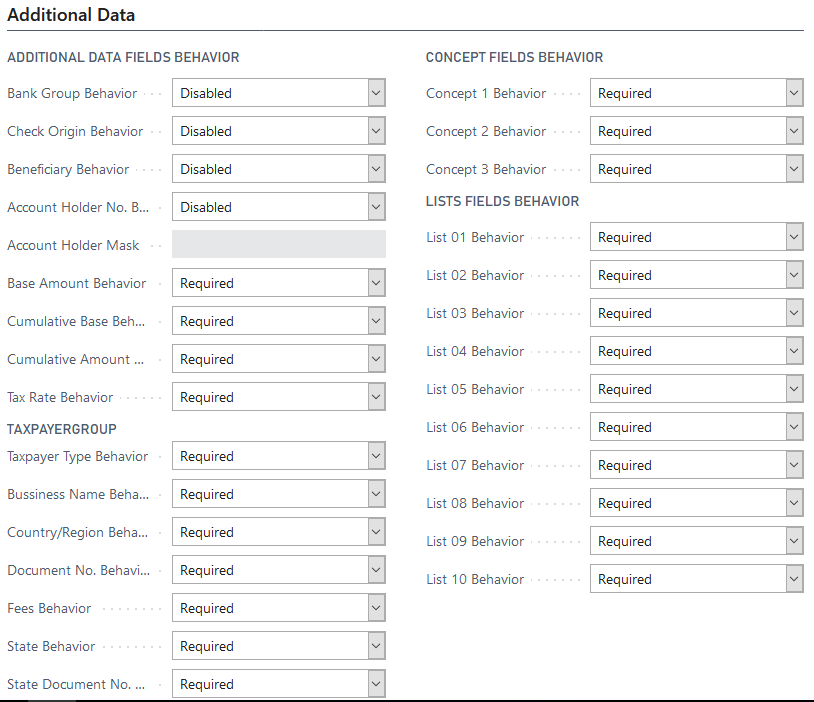
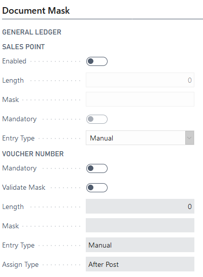

# LATAM Clase de comprobante

## Descripción
Maestro de clase de comprobante. Esta entidad es como un talonario, donde se configuran los campos que va a tener dicho talonario.  

## Sección General
### Campos
***
>#### No.
>>**Descripción**: 
	
>>**Tipo**:Code[15]

>#### Descripción
>>**Descripción**: 
	
>>**Tipo**:Code[30]

>#### Descripción Legal
>>**Descripción**: 
	
>>**Tipo**:Code[5]

>#### Tipo Clase Comprobantes
>>**Descripción**: id tipo clase de comprobante. Indica que comportamiento va a tener este comprobante, el cual esta supeditado a lo configurado en el [tipo clase comprobante](LATAM-VoucherClassType.md)
	
>>**Tipo**:Code[5]

>#### Letra
>>**Descripción**: Letra que tiene asignada el comprobante. Esto permite identificar de otra forma los comprobantes. Por ejemplo Factura, pueden haber facturas 'A', 'B', 'C'. Este campo sirve para identificar esta tipificación.
	
>>**Tipo**:Code[5]

>#### Prefijo
>>**Descripción**: Cadena de caracteres que forma parte del cálculo del [número de comprobante completo](../LATAM-DocumentExtension.md#numero-de-documento-completo). Este prefijo es formado por el [prefijo del tipo de comprobante](LATAM-VoucherClassType.md#prefijo) y el [prefijo de la letra](../Maestros/LATAM-VoucherClassLetter.md#prefijo)
	
>>**Tipo**:Code[5]

>#### Inactivo
>>**Descripción**: 
	
>>**Tipo**:Code[5]

>#### Forzar ...
>>**Descripción**: 
	
>>**Tipo**:Code[5]

>#### Cálculo de retenciones
>>**Descripción**: 
	
>>**Tipo**:Code[5]

>#### Separador
>>**Descripción**: Caracter que permite introducir un separador al crear el [número de comprobante completo en la Extensión de documentos](../LATAM-DocumentExtension.md#numero-de-documento-completo). por ejemplo '-'.
	
>>**Tipo**:Code[5]

>#### copiar número de documento
>>**Descripción**: 
	
>>**Tipo**:Code[5]

>#### Requiere CA
>>**Descripción**: 
	
>>**Tipo**:Code[5]

>#### Requiere código de control
>>**Descripción**: 
	
>>**Tipo**:Code[5]

>#### Tipo de código de control
>>**Descripción**: 
	
>>**Tipo**:Code[5]

>#### Rótulo de concepto 1
>>**Descripción**: 
	
>>**Tipo**:Code[5]

>#### Rótulo de concepto 2
>>**Descripción**: 
	
>>**Tipo**:Code[5]

>#### Rótulo de concepto 3
>>**Descripción**: 
	
>>**Tipo**:Code[5]

>#### Reporte
>>**Descripción**: 
	
>>**Tipo**:Code[5]

>#### Tipo transacción banco
>>**Descripción**: 
	
>>**Tipo**:Code[5]

>#### Detalla contribuyente
>>**Descripción**:
Si este campo esta marcado, cambia el comportamiento a requerido de los campos en el [grupo de contribuyente](../Maestros/LATAM-VoucherClass.md#grupo-contribuyente) en la [sección de datos adicionales](../Maestros/LATAM-VoucherClass.md#seccion-datos-adicionales) en la entidad comprobante  
	
>>**Tipo**:boolean

>#### Incluye impuestos
>>**Descripción**: 
	
>>**Tipo**:Code[5]
***
## Sección Datos Adicionales

## Descripción
Configuración de campos adicionales. Esta sección permite configurar el comportamiento de los campos adicionales, los cuales aparecen en el formulario de [Extensión de Documentos](../LATAM-DocumentExtension.md). Están agrupados por secciones que son las mismas que tiene esta sección. Los comportamientos pueden ser:

* **Deshabilitado:** El campo aparece deshabilitado.
* **Habilitado:** El campo aparece como editable.
* **Requerido:** El campo aparece como editable y requerido.  

### Campos
***
>#### Comportamiento grupo banco.
>>**Descripción**: 
	
>>**Tipo**:Code[15]
>#### Grupo contribuyente
>>######	Tipo contribuyente
>>>**Descripción**: 
Permite administrar el comportamiento de los campos en el grupo [contribuyente en la página extensión de documentos](../LATAM-DocumentExtension.md#seccion-contribuyentes). 
>>**Tipo**:Code[15]
***
## Sección Máscara Documento

## Descripción
Configuración de máscaras para el punto de venta y el comprobante. Cuando se usa el comprobante en la ventana [Extensión de Documentos](../LATAM-DocumentExtension.md). Se disparan una series de comportamientos referidos al número de comprobante y punto de venta. Esta sección se sub divide a su vez por las entidades mensionadas anteriormente:

* Cuenta GL
* Cliente
* Proveedor
* Banco 
* Activo Fijo

cada una de estas secciones a su vez tiene dos secciones mas que son punto de venta y número de comprobante, pero el comportamiento que se describe se aplica a cada una de las secciones de las entidades.

### Sub sección punto de ventas
***
>#### Habilitado.
>>**Descripción**: Habilita o no el uso de punto de venta. Si este campo esta en falso en la ventana de extensión de documento el punto de venta está deshabilitado, además de esto los campos obligatorio, longitud, máscara y entrada están deshabilitado. Si está en true el campo punto de venta estará  habilitado en la extensión de documento y se habilitan los campos obligatorio, longitud, máscara y entrada.
	
>>**Tipo**:boolean

>#### Longitud.
>>**Descripción**: Indica la longitud que debe tener el prefijo en [Punto de venta](../Maestros/LATAM-SalesPoint.md#prefijo-punto-de-venta). Esta validación se ejecuta en el campo [prefijo de punto de venta en extensión de documentos](../LATAM-DocumentExtension.md#prefijo)

>>**Habilitado**: Si esta en true el campo Habilitado.

>>**Tipo**:boolean

>#### Obligatorio.
>>**Descripción**: Indica que el punto de venta o el [prefijo de Punto de venta](../Maestros/LATAM-SalesPoint.md). es obligatorio.

>>**Habilitado**: Si esta en true el campo Habilitado.

>>**Tipo**:boolean

>#### Máscara.
>>**Descripción**: Mascara para validar el prefijo de [Punto de venta](../Maestros/LATAM-SalesPoint.md).

>>**Habilitado**: Si esta en true el campo Habilitado.

>>**Tipo**:boolean
***