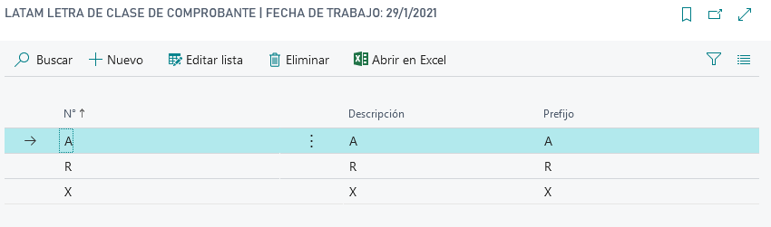

# LATAM Letra de clase de comprobante

## Descripción
Maestro de letra de clase de comprobante. Este maestro se usa en la generación del número completo de clase de comprobante, en las extensiones a los documentos nativos de Business Central. Por ejemplo en ordenes de compra, factura, devoluciones, remitos.

## Sección Grilla
### Campos
***
>#### No.
>>**Descripción**: 
	Es el identificador de la letra de clase de comprobante.
	
>>**Uso**:
>>> * [Clase de comprobante](LATAM-VoucherClass.md)

>>**Tipo**:Code[15]

>#### Descripción
>>**Descripción**: 
	Breve descripción en texto sobre la letra de comprobante. 
	
>>**Tipo**:Code[30]

>#### Prefijo
>>**Descripción**: 
	Es el prefijo que se usa en la generación de número completo de comprobante. Ver el campo Número de documento completo. Este campo tiene la validación que no puede superar la cantidad de caracteres especificada en el campo [Long. prefijo letra clase comprobante.](../LATAM-Setup/LATAM-Setup.md#long-prefijo-letra-clase-comprobante)
	
>>**Tipo**:Code[5]
***
