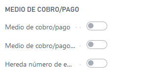
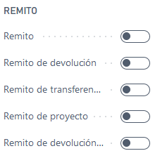
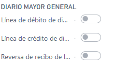
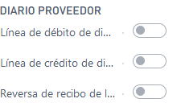
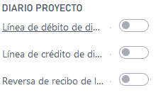
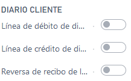
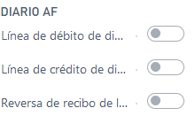

# LATAM Voucher Class Type

## Descripción
Este maestro es una tipificación para las [clases de comprobantes](../Maestros/LATAM-VoucherClass.md). Hay varias secciones en esta entidad, cada una representa un tipo de documento que puede ser usada en distintas entidades por ejemplo el grupo facturas tiene facturas de ventas, factura de compras, factura de servicios. Cada uno de estos check representa que puede ser usada como la extensión de un determinado documento.

## Sección General
>#### No.
>>**Descripción**: 
	Identificador de tipo clase de comprobante.
	
>>**Tipo**:Code

>#### Descripción
>>**Descripción**: 
	texto descriptivo.
	
>>**Tipo**:text

>#### Prefijo
>>**Descripción**: 
	Cadena de caracteres limitada por el campo [long. prefijo tipo clase comprobante](../LATAM-Setup/LATAM-Setup.md#long-prefijo-tipo-clase-comprobante), en la [configuración de latam](../LATAM-Setup/LATAM-Setup.md)
	
>>**Tipo**:boolean

## Sección Medio Cobro Pago

>#### Medio de cobro/pago
>>**Descripción**: 
	Los comprobantes pueden ser agrupados en dos grandes conjuntos, un conjunto es el de comprobantes (facturas, remitos, notas de crédito) y otro es el de  medios de cobro pago. Todo comprobante que sea un medio de cobro pago debe tener un tipo de clase de comprobante con este flag en `true`
	
>>**Tipo**:boolean

>#### Medio de cobro/pago único por comprobante
>>**Descripción**: 
	FALTA DEFINIR
	
>>**Tipo**:boolean

>#### Hereda número de encabezado
>>**Descripción**: 
	FALTA DEFINIR
	
>>**Tipo**:boolean

## Sección Facturas

### Campos
>#### Factura Ventas
>>**Descripción**: 
	Indica que puede ser usado en facturas de ventas.
	
>>**Tipo**:boolean

>#### Factura de servicio
>>**Descripción**: 
	Indica que puede ser usado en facturas de servicio.
	
>>**Tipo**:boolean

>#### Factura Compras
>>**Descripción**: 
	Indica que puede ser usado en facturas de compra.
	
>>**Tipo**:boolean

>#### Factura de proyecto
>>**Descripción**: 
	Indica que puede ser usado en facturas de proyecto.
	
>>**Tipo**:boolean

## Sección notas de crédito

### Campos
>#### Notas de crédito de ventas
>>**Descripción**: 
	Indica que puede ser usado en notas de crédito de ventas.
	
>>**Tipo**:boolean

>#### Notas de crédito de servicio
>>**Descripción**: 
	Indica que puede ser usado en notas de crédito de servicio.
	
>>**Tipo**:boolean

>#### Notas de crédito de Compras
>>**Descripción**: 
	Indica que puede ser usado en notas de crédito de compra.
	
>>**Tipo**:boolean

>#### Notas de crédito de proyecto
>>**Descripción**: 
	Indica que puede ser usado en notas de crédito de proyecto.
	
>>**Tipo**:boolean

## Sección remito

### Campos
>#### Remito
>>**Descripción**: 
	Indica que puede ser usado como remito.
	
>>**Tipo**:boolean

>#### Remito de devolución
>>**Descripción**: 
	Indica que puede ser usado como remito de devolución.
	
>>**Tipo**:boolean

>#### Remito de transferencia de inventario
>>**Descripción**: 
	Indica que puede ser usado como remito de transferencia de inventario.
	
>>**Tipo**:boolean

>#### Remito de proyecto
>>**Descripción**: 
	Indica que puede ser usado como remito de proyecto.
	
>>**Tipo**:boolean

>#### Remito de devolución proyecto
>>**Descripción**: 
	Indica que puede ser usado como remito de devolución de proyecto.
	
>>**Tipo**:boolean

## Sección Diario

>### Diario Mayor General

>>### Campos
>>>>#### Línea de débito de diario de GL

>>>>**Descripción**: 
	Indica que puede ser usado como una línea de débito de diario GL.
	
>>>>**Tipo**: boolean

>>>>#### Línea de crédito de diario de GL

>>>>**Descripción**: 
	Indica que puede ser usado como una línea de crédito de diario GL.
	
>>>>**Tipo**: boolean

>>>>#### Reversa de recibo de línea GL

>>>>**Descripción**: 
	Indica que puede ser usado como reversa de recibo de línea GL.
	
>>>>**Tipo**: boolean

>### Diario Proveedor

>>### Campos
>>>>#### Línea de débito de diario de proveedor

>>>>**Descripción**: 
	Indica que puede ser usado como una línea de débito de diario de proveedor.
	
>>>>**Tipo**: boolean

>>>>#### Línea de crédito de diario de proveedor

>>>>**Descripción**: 
	Indica que puede ser usado como una línea de crédito de diario proveedor.
	
>>>>**Tipo**: boolean

>>>>#### Reversa de recibo de línea proveedor

>>>>**Descripción**: 
	Indica que puede ser usado como reversa de recibo de línea proveedor.
	
>>>>**Tipo**: boolean

>### Diario Proyecto

>>### Campos
>>>>#### Línea de débito de diario de proyecto

>>>>**Descripción**: 
	Indica que puede ser usado como una línea de débito de diario proyecto.
	
>>>>**Tipo**: boolean

>>>>#### Línea de crédito de diario de proyecto

>>>>**Descripción**: 
	Indica que puede ser usado como una línea de crédito de diario proyecto.
	
>>>>**Tipo**: boolean

>>>>#### Reversa de recibo de línea proyecto

>>>>**Descripción**: 
	Indica que puede ser usado como reversa de recibo de línea proyecto.
	
>>>>**Tipo**: boolean

>### Diario Cliente

>>### Campos
>>>>#### Línea de débito de diario de cliente

>>>>**Descripción**: 
	Indica que puede ser usado como una línea de débito de diario cliente.
	
>>>>**Tipo**: boolean

>>>>#### Línea de crédito de diario de cliente

>>>>**Descripción**: 
	Indica que puede ser usado como una línea de crédito de diario cliente.
	
>>>>**Tipo**: boolean

>>>>#### Reversa de recibo de línea cliente

>>>>**Descripción**: 
	Indica que puede ser usado como reversa de recibo de línea cliente.
	
>>>>**Tipo**: boolean

>### Diario AF

>>### Campos
>>>>#### Línea de débito de diario de AF

>>>>**Descripción**: 
	Indica que puede ser usado como una línea de débito de diario AF.
	
>>>>**Tipo**: boolean

>>>>#### Línea de crédito de diario de AF

>>>>**Descripción**: 
	Indica que puede ser usado como una línea de crédito de diario AF.
	
>>>>**Tipo**: boolean

>>>>#### Reversa de recibo de línea AF

>>>>**Descripción**: 
	Indica que puede ser usado como reversa de recibo de línea AF.
	
>>>>**Tipo**: boolean

>### Diario Banco

>>### Campos
>>>>#### Línea de débito de diario de Banco

>>>>**Descripción**: 
	Indica que puede ser usado como una línea de débito de diario Banco.
	
>>>>**Tipo**: boolean

>>>>#### Línea de crédito de diario de Banco

>>>>**Descripción**: 
	Indica que puede ser usado como una línea de crédito de diario Banco.
	
>>>>**Tipo**: boolean

>>>>#### Reversa de recibo de línea Banco

>>>>**Descripción**: 
	Indica que puede ser usado como reversa de recibo de línea Banco.
	
>>>>**Tipo**: boolean
